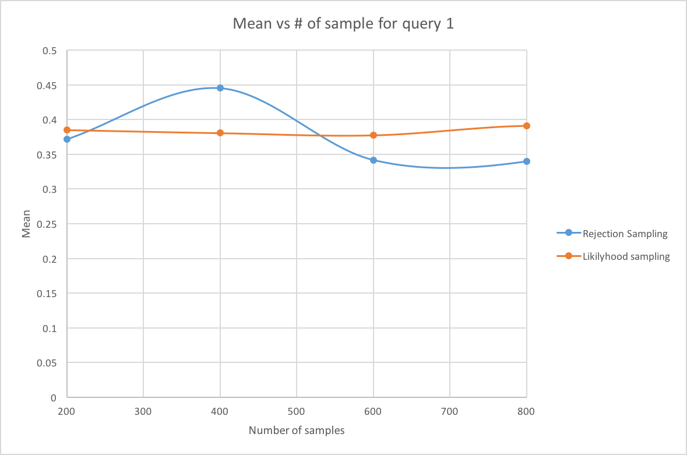
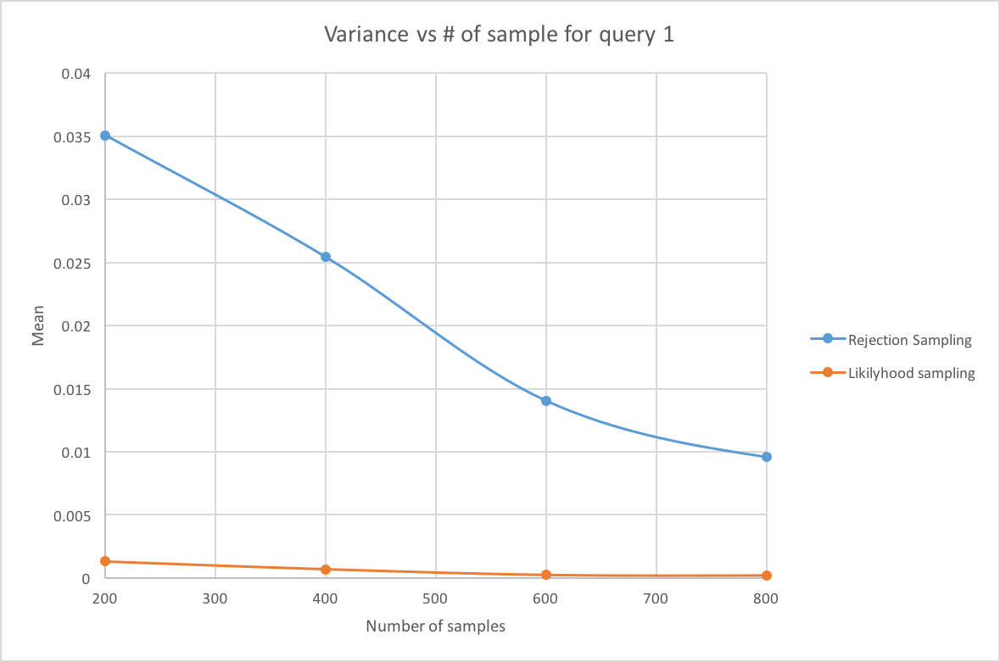
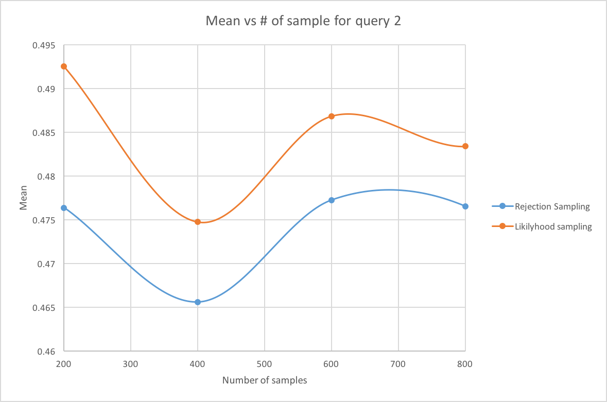
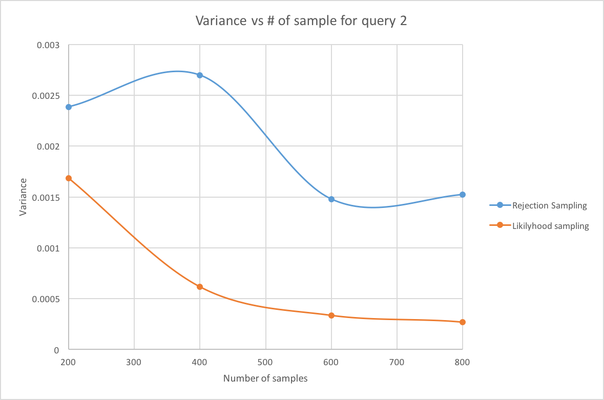

# Analyzing the Bayesian Network

For both rejection sampling and likelihood weighting, a series of trials were run on
different sample sizes (200 - 1000) in order to detect and plot trends in the output of the program. Please find the data recorded through this experiment in the sections below.

## Query 1
The following data was collected using network_option_b as the network file and query1.txt as the query file.

### Rejection Sampling
|               | 200      | 400      | 600      | 800      | 1000     |
| ------------- | -------- | -------- | -------- | -------- | -------- |
| **Trial #1**  | 0.5      | 0.315789 | 0.310345 | 0.407407 | 0.441176 |
| **Trial #2**  | 0.25     | 0.5      | 0.5      | 0.258065 | 0.35     |
| **Trial #3**  | 0.5      | 0.5      | 0.136364 | 0.290323 | 0.428571 |
| **Trial #4**  | 0.214286 | 0.571429 | 0.478261 | 0.371429 | 0.189189 |
| **Trial #5**  | 0.571429 | 0.3125   | 0.333333 | 0.151515 | 0.37931  |
| **Trial #6**  | 0.375    | 0.666667 | 0.233333 | 0.263158 | 0.439024 |
| **Trial #7**  | 0.5      | 0.5      | 0.285714 | 0.461538 | 0.410256 |
| **Trial #8**  | 0        | 0.538462 | 0.28     | 0.344828 | 0.55632  |
| **Trial #9**  | 0.25     | 0.111111 | 0.48     | 0.405405 | 0.439024 |
| **Trial #10** | 0.555556 | 0.4375   | 0.380952 | 0.444444 | 0.416667 |

|              | 200         | 400         | 600         | 800         | 1000        |
| ------------ | ----------- | ----------- | ----------- | ----------- | ----------- |
| **Mean**     | 0.3716271   | 0.4453458   | 0.3418302   | 0.3398112   | 0.4049537   |
| **Variance** | 0.035072227 | 0.025413261 | 0.014030665 | 0.009569414 | 0.008611154 |

### Likelihood Weighting
|               | 200         | 400         | 600         | 800         | 1000        |
| ------------- | ----------- | ----------- | ----------- | ----------- | ----------- |
| **Trial #1**  | 0.343741    | 0.343641    | 0.369111    | 0.364738    | 0.419542    |
| **Trial #2**  | 0.38112     | 0.40237     | 0.388976    | 0.413753    | 0.367964    |
| **Trial #3**  | 0.340593    | 0.359771    | 0.344061    | 0.408695    | 0.396542    |
| **Trial #4**  | 0.373742    | 0.371838    | 0.365574    | 0.382552    | 0.362269    |
| **Trial #5**  | 0.395362    | 0.357481    | 0.380969    | 0.39255     | 0.375072    |
| **Trial #6**  | 0.390704    | 0.372775    | 0.376853    | 0.398935    | 0.373945    |
| **Trial #7**  | 0.445145    | 0.366015    | 0.396328    | 0.384426    | 0.396751    |
| **Trial #8**  | 0.341406    | 0.407574    | 0.383919    | 0.387174    | 0.397791    |
| **Trial #9**  | 0.413273    | 0.398474    | 0.375949    | 0.389005    | 0.385979    |
| **Trial #10** | 0.425933    | 0.42649     | 0.393058    | 0.390961    | 0.378586    |

|              | 200         | 400         | 600         | 800         | 1000        |
| ------------ | ----------- | ----------- | ----------- | ----------- | ----------- |
| **Mean**     | 0.3851019   | 0.3806429   | 0.3774798   | 0.3912789   | 0.3854441   |
| **Variance** | 0.001327624 | 0.000701324 | 0.000235008 | 0.000190922 | 0.000299543 |

### Comparison
In order to compare the trends between these two sets of output, we created two line graphs to demonstrate the trends between the mean and the variance of both sets.

## Query 2
The following data was collected using network_option_b as the network file and query2.txt as the query file.

### Rejection Sampling
|               | 200      | 400      | 600      | 800      | 1000     |
| ------------- | -------- | -------- | -------- | -------- | -------- |
| **Trial #1**  | 0.38     | 0.458647 | 0.515152 | 0.439516 | 0.435737 |
| **Trial #2**  | 0.53125  | 0.492063 | 0.457711 | 0.448148 | 0.431138 |
| **Trial #3**  | 0.43662  | 0.467742 | 0.420513 | 0.511211 | 0.470588 |
| **Trial #4**  | 0.5      | 0.453782 | 0.445087 | 0.542017 | 0.48     |
| **Trial #5**  | 0.477612 | 0.384615 | 0.5      | 0.434426 | 0.466049 |
| **Trial #6**  | 0.552239 | 0.52381  | 0.489796 | 0.482625 | 0.426332 |
| **Trial #7**  | 0.451613 | 0.561151 | 0.518717 | 0.508    | 0.467492 |
| **Trial #8**  | 0.457627 | 0.401361 | 0.448649 | 0.452    | 0.424437 |
| **Trial #9**  | 0.491525 | 0.453782 | 0.531792 | 0.509881 | 0.56311  |
| **Trial #10** | 0.485294 | 0.459016 | 0.444976 | 0.4375   | 0.48     |

|               | 200       | 400         | 600         | 800         | 1000        |
| ------------- | --------- | ----------- | ----------- | ----------- | ----------- |
| Mean          | 0.476378  | 0.4655969   | 0.4772393   | 0.4765324   | 0.4644883   |
| Variance      | 0.0023854 | 0.002697724 | 0.001477868 | 0.001522722 | 0.001695002 |

### Likelihood Weighting
|               | 200   | 400    | 600      | 800     | 1000  |
| ------------- | ----- | ------ | -------- | ------- | ----- |
| **Trial #1**  | 0.47  | 0.4725 | 0.485    | 0.4625  | 0.492 |
| **Trial #2**  | 0.545 | 0.455  | 0.495    | 0.50375 | 0.492 |
| **Trial #3**  | 0.48  | 0.5    | 0.496667 | 0.475   | 0.486 |
| **Trial #4**  | 0.505 | 0.505  | 0.525    | 0.45875 | 0.492 |
| **Trial #5**  | 0.475 | 0.445  | 0.483333 | 0.485   | 0.502 |
| **Trial #6**  | 0.525 | 0.5025 | 0.483333 | 0.5     | 0.478 |
| **Trial #7**  | 0.435 | 0.4325 | 0.46     | 0.50125 | 0.483 |
| **Trial #8**  | 0.43  | 0.485  | 0.481667 | 0.475   | 0.468 |
| **Trial #9**  | 0.54  | 0.47   | 0.495    | 0.49625 | 0.487 |
| **Trial #10** | 0.52  | 0.48   | 0.463333 | 0.47625 | 0.497 |

|               | 200         | 400         | 600         | 800         | 1000        |
| ------------- | ----------- | ----------- | ----------- | ----------- | ----------- |
| **Mean**      | 0.4925      | 0.47475     | 0.4868333   | 0.483375    | 0.4877      |
| **Variance**  | 0.001684722 | 0.000615903 | 0.000334848 | 0.000268073 | 9.49E-05    |

### Comparison

Like with query 1, two plots were generated to compare the mean and variance for both sets of data.

## Conclusion
For both queries, it is quite apparent that both methods demonstrate convergence. For query 1, the two methods seemed to converge around a 40% probability. However, in comparing the two methods, we see that likelihood weighting reaches this convergence much faster using an almost completely linear data set, while the data set of rejection sampling fluctuates greatly while doing so. For query 2, both methods tend to converge around 50%. Again, likelihood weighting produces far more linear output than rejection sampling, which still fluctuates in its data set. We notice that the variance is far, *far* lower than the variance of rejection sampling, which is expected given the trends in the data. This trend is most likely caused by the likelihood weighting algorithm's ability to measure the probability that a sample with remain consistent with the evidence, lowering the chance of random samples to bleed through into the output.
